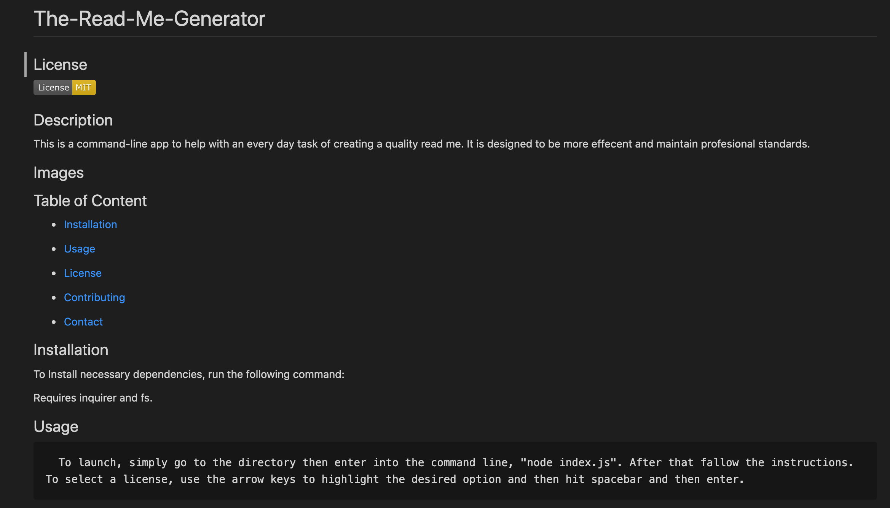
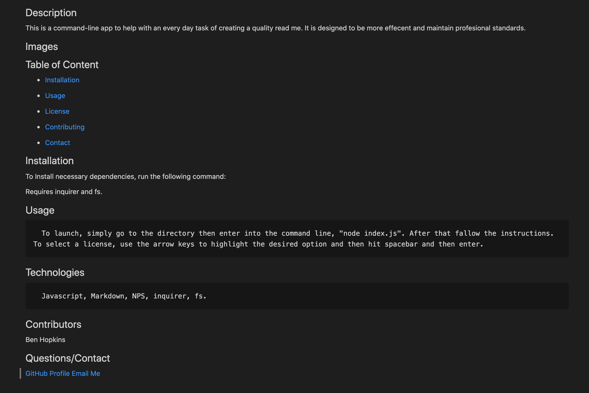
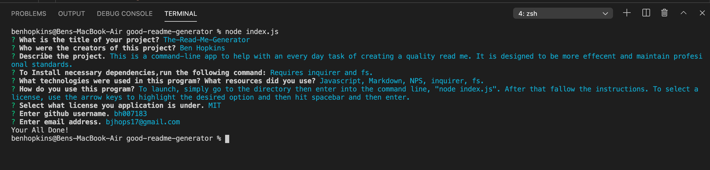

  # The-Read-Me-Generator

   
  ## License
  
  <a href="https://opensource.org/licenses/MIT"></img></a>

  ## Description

  This is a command-line app to help with an every day task of creating a quality read me. It is designed to be more effecent and maintain profesional standards.

  ## Video link

  <a href="https://drive.google.com/file/d/1CJXXGrH4bY0jpeWBMvINEVivyY87gaag/view">Video</a>

  ## Images

  
  
  

  
  ## Table of Content

  * [Installation](#installation)

  * [Usage](#usage)

  * [License](#license)

  * [Contributing](#contributors)

  * [Contact](#questions/contact)

  ## Installation

  To Install necessary dependencies, run the following command:
  
  Requires inquirer and fs.

  ## Usage

      To launch, simply go to the directory then enter into the command line, "node index.js". After that fallow the instructions. To select a license, use the arrow keys to highlight the desired option and then hit spacebar and then enter.
  
  ## Technologies

      Javascript, Markdown, NPS, inquirer, fs.

  ## Contributors

  Ben Hopkins

  ## Questions/Contact

  <a href="https://github.com/bh007183">GitHub Profile</a>
  <a href="mailto:bjhops17@gmail.com"> Email Me</a>
  
  

  